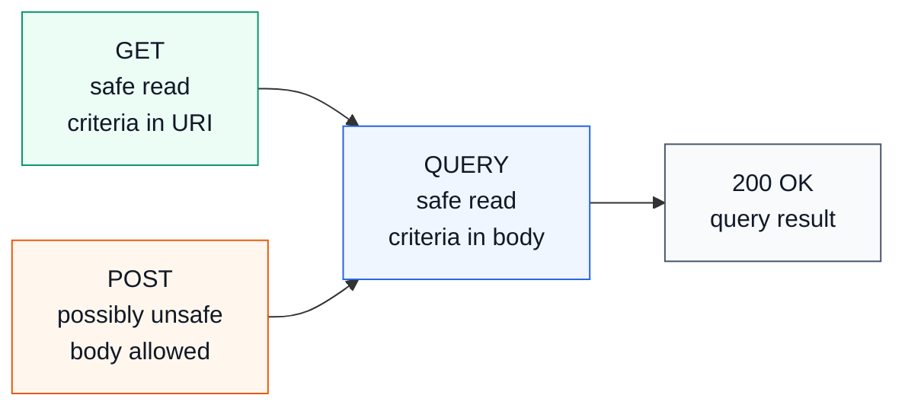
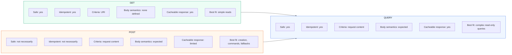
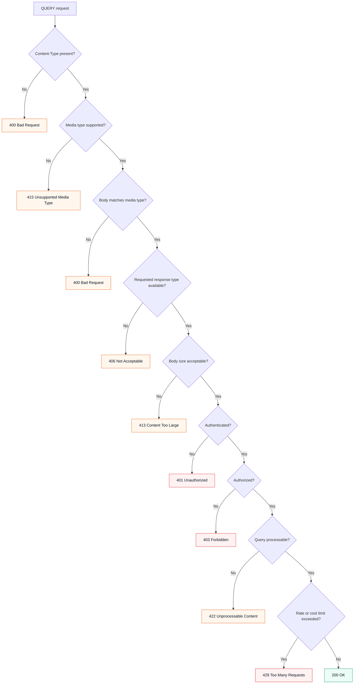
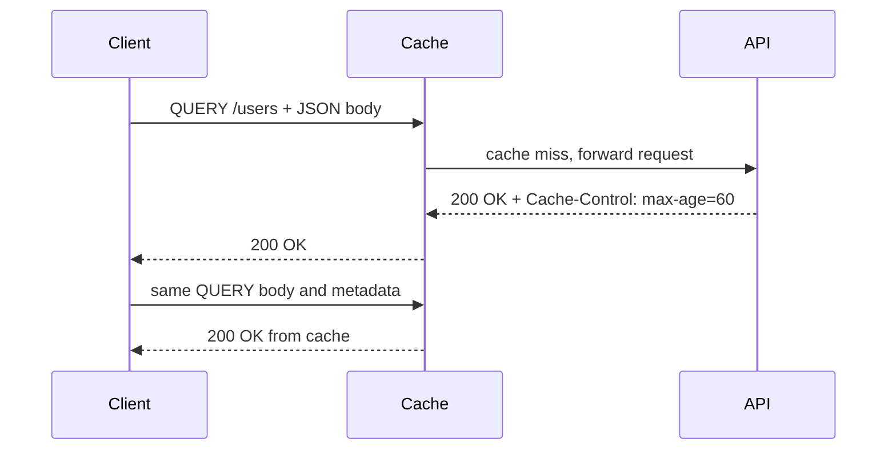
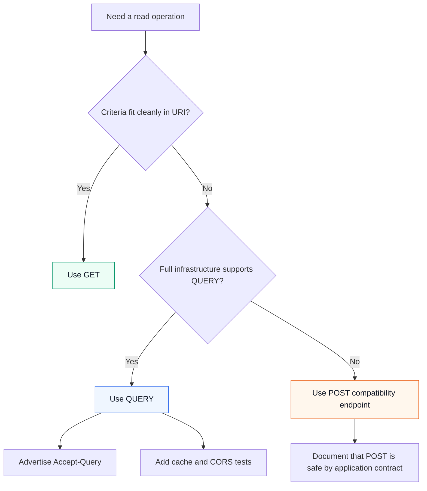

HTTP now has a standard method for read-only requests that need a body: `QUERY`.

The method was standardized as [RFC 10008](https://www.rfc-editor.org/rfc/rfc10008.html) in June 2026. It is no longer just an IETF draft. The core idea is simple: a client can send query criteria in the request content, while still making a request that is safe, idempotent, and cacheable.

That fills a long-standing gap between `GET` and `POST`.

## Why QUERY Exists

Most APIs start with `GET` for reads:

```http
GET /api/v1/users?status=active&city=Boston&sort=name HTTP/1.1
Host: api.example.com
Accept: application/json
```

That works until the query becomes too large, too structured, or too sensitive for a URI:

```http
GET /api/v1/users?filter[age][gte]=25&filter[age][lte]=40&filter[city][]=Boston&filter[city][]=New%20York&filter[permissions][all][]=billing.read&filter[permissions][all][]=reports.export&sort[0][field]=name&sort[0][direction]=asc&page[number]=1&page[size]=50 HTTP/1.1
Host: api.example.com
```

RFC 10008 calls out several problems with pushing everything into the URI:

- URI size limits are not always known because requests pass through clients, proxies, gateways, CDNs, servers, and logs.
- Encoding structured data into a URI can be awkward and inefficient.
- URIs are commonly logged and bookmarked, which can expose information that would be safer in request content.
- Treating every possible query combination as a distinct resource can make API design harder to reason about.

The common workaround is `POST /search`:

```http
POST /api/v1/users/search HTTP/1.1
Host: api.example.com
Content-Type: application/json
Accept: application/json

{
  "status": "active",
  "city": ["Boston", "New York"],
  "age": { "gte": 25, "lte": 40 },
  "sort": [{ "field": "name", "direction": "asc" }],
  "page": { "number": 1, "size": 50 }
}
```

That is practical, but semantically muddy. `POST` does not tell generic HTTP components that this is a safe query. It may work perfectly inside your application, but intermediaries cannot assume the same retry and caching behavior they can assume for safe methods.

`QUERY` expresses the same request more directly:

```http
QUERY /api/v1/users HTTP/1.1
Host: api.example.com
Content-Type: application/json
Accept: application/json

{
  "status": "active",
  "city": ["Boston", "New York"],
  "age": { "gte": 25, "lte": 40 },
  "sort": [{ "field": "name", "direction": "asc" }],
  "page": { "number": 1, "size": 50 }
}
```

## What QUERY Means

`QUERY` asks the target resource to process the enclosed request content as a query and return the result.

It has three important properties:

- **Safe:** the client is not asking the server to change the target resource.
- **Idempotent:** repeating the same request has the same intended effect.
- **Cacheable:** a cache may store and reuse a `QUERY` response for later matching `QUERY` requests, if normal HTTP caching rules allow it.



The body is not optional decoration. For `QUERY`, the request content and its media type define the query. RFC 10008 says servers must fail a request when `Content-Type` is missing or inconsistent with the content.

## QUERY vs GET vs POST



Use `GET` when the request is naturally URI-shaped. Use `QUERY` when the operation is still a read, but the criteria belong in structured request content. Use `POST` when the operation creates something, triggers a command, or when your production infrastructure cannot yet pass `QUERY` reliably.

## Content Negotiation

`QUERY` is body-format agnostic. JSON is common for application APIs, but the method does not require JSON.

```http
QUERY /api/v1/orders HTTP/1.1
Host: api.example.com
Content-Type: application/json
Accept: application/json

{
  "customerId": "cus_123",
  "createdAt": { "gte": "2026-01-01", "lt": "2026-07-01" },
  "status": ["paid", "refunded"]
}
```

RFC 10008 also defines the `Accept-Query` response header. A resource can use it to advertise the media types it accepts for `QUERY` request content:

```http
HTTP/1.1 200 OK
Content-Type: application/json
Accept-Query: "application/json", "application/jsonpath"
```

This is not the same header as `Accept-Post`. For `QUERY`, the standard header is `Accept-Query`.

## Status Codes

For successful query results, `200 OK` is the normal response:

```http
HTTP/1.1 200 OK
Content-Type: application/json
Cache-Control: max-age=60
Accept-Query: "application/json"

{
  "data": [],
  "page": { "number": 1, "size": 50 },
  "total": 0
}
```

An empty result set should normally be `200 OK` with an empty collection. `404 Not Found` means the target resource is not found; it does not mean "your query matched zero rows."

Recommended error handling:



## Caching

`QUERY` responses are cacheable, but caching is more involved than caching `GET`.

A cache key for `QUERY` has to account for the target URI, request content, and relevant request metadata such as `Content-Type`, `Accept`, content encoding, and other varying fields. Two bodies that are semantically different must not collapse into the same cache entry.



RFC 10008 also defines how servers can make follow-up requests easier:

- `Content-Location` can identify a resource representing the result of this query.
- `Location` can identify an equivalent resource that lets the client repeat the query with `GET`.

Example:

```http
QUERY /api/v1/reports HTTP/1.1
Host: api.example.com
Content-Type: application/json
Accept: text/csv

{
  "from": "2026-01-01",
  "to": "2026-06-30",
  "groupBy": "month"
}
```

```http
HTTP/1.1 200 OK
Content-Type: text/csv
Cache-Control: max-age=300
Location: /api/v1/reports/queries/8f4f3a
Accept-Query: "application/json"

month,total
2026-01,49320
2026-02,51210
```

The client can later use:

```http
GET /api/v1/reports/queries/8f4f3a HTTP/1.1
Host: api.example.com
Accept: text/csv
```

Do not put sensitive query values into generated `Location` or `Content-Location` URIs.

## Browser and CORS Notes

`QUERY` is not a CORS-safelisted method. Browser requests from one origin to another will require a preflight request:

```http
OPTIONS /api/v1/users HTTP/1.1
Origin: https://app.example.com
Access-Control-Request-Method: QUERY
Access-Control-Request-Headers: content-type
```

The server must explicitly allow it:

```http
HTTP/1.1 204 No Content
Access-Control-Allow-Origin: https://app.example.com
Access-Control-Allow-Methods: GET, POST, QUERY
Access-Control-Allow-Headers: content-type
```

This is one of the practical adoption checks: your browser clients, CORS layer, API gateway, CDN, reverse proxy, service mesh, and framework routing all need to pass and understand the method well enough for your use case.

## Spring Boot Reality Check

Spring Boot applications commonly use Spring MVC. In the current Spring Framework 7.0.8 Javadoc, `org.springframework.web.bind.annotation.RequestMethod` lists `GET`, `HEAD`, `POST`, `PUT`, `PATCH`, `DELETE`, `OPTIONS`, and `TRACE`. It does not include `QUERY`.

The same Javadoc notes that `DispatcherServlet` supports `GET`, `HEAD`, `POST`, `PUT`, `PATCH`, and `DELETE` by default; `TRACE` and `OPTIONS` require explicit dispatch settings. A custom method such as `QUERY` therefore needs more than a normal `@RequestMapping` annotation.

That means this common-looking code is wrong:

```java
@RequestMapping(method = RequestMethod.valueOf("QUERY"))
public ResponseEntity<?> queryUsers(@RequestBody UserQueryRequest request) {
    return ResponseEntity.ok(userService.query(request));
}
```

`RequestMethod` is an enum. `RequestMethod.valueOf("QUERY")` throws `IllegalArgumentException` because there is no enum constant named `QUERY`.

For production Spring MVC APIs today, the conservative choices are:

- Keep simple reads on `GET`.
- Use `POST /search` or `POST /query` as a compatibility fallback for complex read-only queries.
- Add real `QUERY` only after testing the full request path: client, CORS, proxy, gateway, CDN, application server, framework, observability, and cache.

If you intentionally want to experiment with `QUERY` in a Spring Boot application before first-class framework support arrives, handle it at a lower layer and keep it small and explicit. A servlet filter is one option:

```java
@Component
public class UserQueryMethodFilter extends OncePerRequestFilter {

    private static final String QUERY = "QUERY";
    private static final String PATH = "/api/v1/users";

    private final ObjectMapper objectMapper;
    private final UserService userService;

    public UserQueryMethodFilter(ObjectMapper objectMapper, UserService userService) {
        this.objectMapper = objectMapper;
        this.userService = userService;
    }

    @Override
    protected void doFilterInternal(
            HttpServletRequest request,
            HttpServletResponse response,
            FilterChain chain) throws IOException, ServletException {

        if (!QUERY.equals(request.getMethod()) || !PATH.equals(request.getRequestURI())) {
            chain.doFilter(request, response);
            return;
        }

        if (request.getContentType() == null ||
                !request.getContentType().startsWith(MediaType.APPLICATION_JSON_VALUE)) {
            response.setStatus(HttpServletResponse.SC_UNSUPPORTED_MEDIA_TYPE);
            response.setHeader("Accept-Query", "\"application/json\"");
            return;
        }

        UserQueryRequest query = objectMapper.readValue(
                request.getInputStream(),
                UserQueryRequest.class
        );

        PagedResponse<UserDto> result = userService.query(query);

        response.setStatus(HttpServletResponse.SC_OK);
        response.setContentType(MediaType.APPLICATION_JSON_VALUE);
        response.setHeader("Accept-Query", "\"application/json\"");
        response.setHeader(HttpHeaders.CACHE_CONTROL, "max-age=60");
        objectMapper.writeValue(response.getOutputStream(), result);
    }
}
```

This is intentionally not as ergonomic as a normal controller. Once you bypass normal Spring MVC method mapping, you also need to be deliberate about validation, exception mapping, metrics, tracing, access logs, CORS, and tests.

The request and response models can stay ordinary Java records:

```java
public record UserQueryRequest(
        UserFilter filter,
        List<SortField> sort,
        PageSpec page
) {}

public record UserFilter(
        Integer minAge,
        Integer maxAge,
        List<String> city,
        String status,
        List<String> tags
) {}

public record SortField(String field, String direction) {}

public record PageSpec(int number, int size) {}

public record PagedResponse<T>(
        List<T> data,
        long total,
        PageSpec page
) {}
```

The service layer should still use allowlisted fields and typed query construction:

```java
@Service
public class UserService {

    private static final Set<String> ALLOWED_SORT_FIELDS = Set.of("name", "createdAt", "age");

    private final UserRepository userRepository;

    public UserService(UserRepository userRepository) {
        this.userRepository = userRepository;
    }

    public PagedResponse<UserDto> query(UserQueryRequest request) {
        validate(request);

        Specification<User> spec = Specification
                .where(ageGte(request.filter().minAge()))
                .and(ageLte(request.filter().maxAge()))
                .and(cityIn(request.filter().city()))
                .and(statusEq(request.filter().status()));

        Pageable pageable = PageRequest.of(
                request.page().number() - 1,
                request.page().size(),
                toSort(request.sort())
        );

        Page<User> result = userRepository.findAll(spec, pageable);
        return new PagedResponse<>(
                result.getContent().stream().map(UserDto::from).toList(),
                result.getTotalElements(),
                request.page()
        );
    }

    private void validate(UserQueryRequest request) {
        if (request.page().number() < 1) {
            throw new IllegalArgumentException("page.number must be greater than zero");
        }
        if (request.page().size() < 1 || request.page().size() > 100) {
            throw new IllegalArgumentException("page.size must be between 1 and 100");
        }
        for (SortField sort : request.sort()) {
            if (!ALLOWED_SORT_FIELDS.contains(sort.field())) {
                throw new IllegalArgumentException("Unsupported sort field: " + sort.field());
            }
        }
    }

    private Sort toSort(List<SortField> fields) {
        return Sort.by(fields.stream()
                .map(field -> new Sort.Order(
                        Sort.Direction.fromString(field.direction()),
                        field.field()
                ))
                .toList());
    }

    private Specification<User> ageGte(Integer minAge) {
        return minAge == null ? null :
                (root, query, cb) -> cb.greaterThanOrEqualTo(root.get("age"), minAge);
    }

    private Specification<User> ageLte(Integer maxAge) {
        return maxAge == null ? null :
                (root, query, cb) -> cb.lessThanOrEqualTo(root.get("age"), maxAge);
    }

    private Specification<User> cityIn(List<String> cities) {
        return cities == null || cities.isEmpty() ? null :
                (root, query, cb) -> root.get("city").in(cities);
    }

    private Specification<User> statusEq(String status) {
        return status == null || status.isBlank() ? null :
                (root, query, cb) -> cb.equal(root.get("status"), status);
    }
}
```

## Security Checklist

Treat `QUERY` as a read method, not as a harmless method.

- Enforce authentication and authorization exactly as you would for `GET` or `POST`.
- Cap request body size at the gateway or with an application filter.
- Validate the body against a schema or DTO constraints.
- Allowlist filter fields, sort fields, operators, and page sizes.
- Put cost limits on expensive filters, joins, aggregations, and full-text searches.
- Use parameterized database APIs or typed query builders.
- Avoid content sniffing; reject missing or incorrect `Content-Type`.
- Configure CORS preflight for browser clients.
- Avoid sensitive values in generated `Location`, `Content-Location`, logs, traces, and metrics.
- Test cache behavior carefully; a bad `QUERY` cache key can leak or mix results.

## Adoption Guidance

`QUERY` is now a real HTTP method, registered by IANA and defined by RFC 10008. That does not mean every framework, proxy, CDN, API documentation tool, browser integration, and client library has caught up.

A practical rollout path looks like this:



For new public APIs, document both the ideal semantics and the compatibility story. For internal APIs, you can move faster, but only after proving that the full path handles custom methods correctly.

## Key Takeaways

`QUERY` gives HTTP a standard way to say: "this is a safe query, and the query input is in the body."

Use it when that distinction matters. Keep `GET` for simple reads. Keep `POST` for mutations, commands, and compatibility fallbacks. Before adopting `QUERY` in production, test the infrastructure around the application as carefully as the application code itself.

## References

- [RFC 10008: The HTTP QUERY Method](https://www.rfc-editor.org/rfc/rfc10008.html)
- [IETF Datatracker: RFC 10008](https://datatracker.ietf.org/doc/rfc10008/)
- [IANA HTTP Method Registry](https://www.iana.org/assignments/http-methods/http-methods.xhtml)
- [Spring Framework `RequestMethod` API](https://docs.spring.io/spring-framework/docs/current/javadoc-api/org/springframework/web/bind/annotation/RequestMethod.html)
