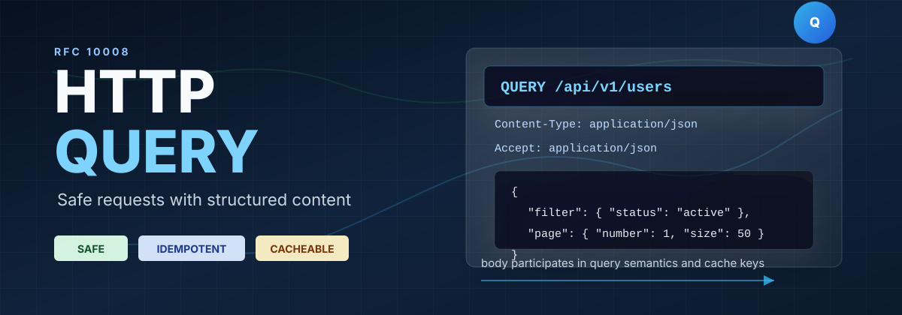
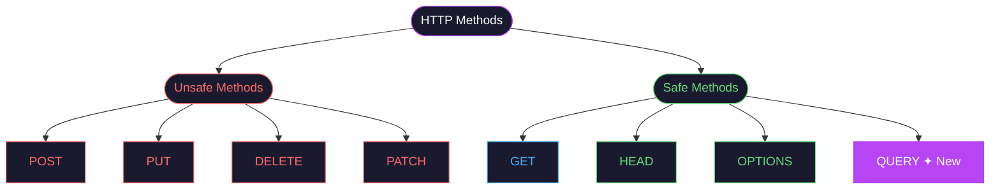
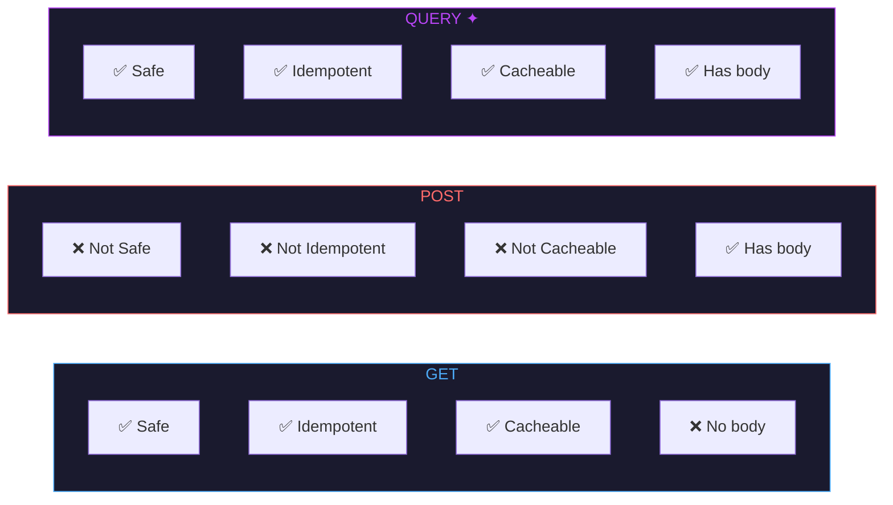
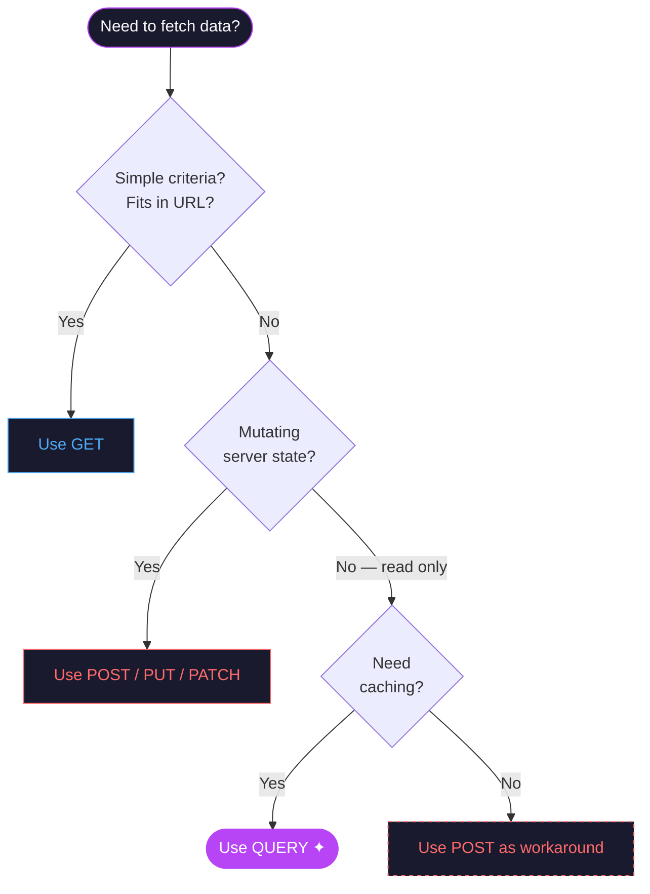
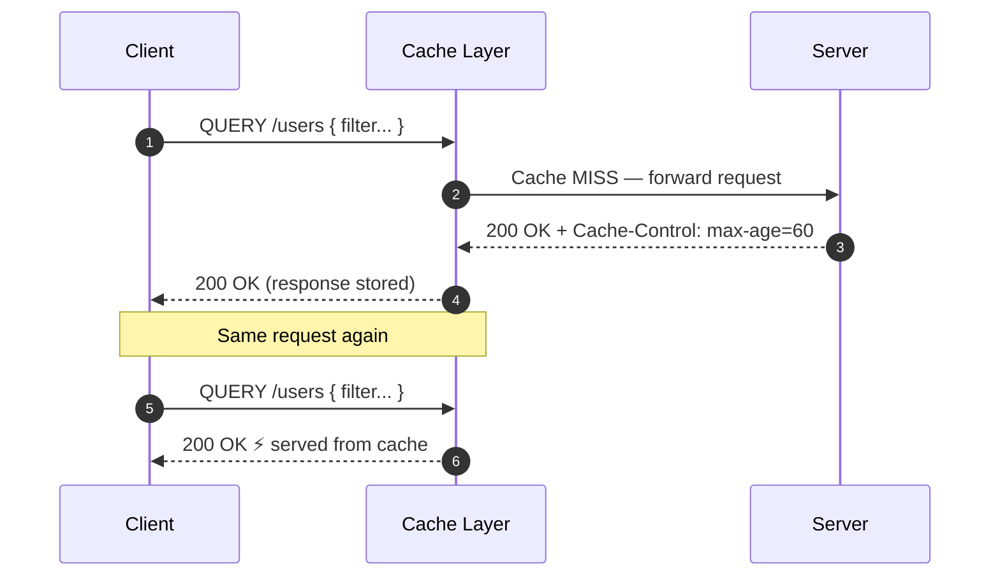
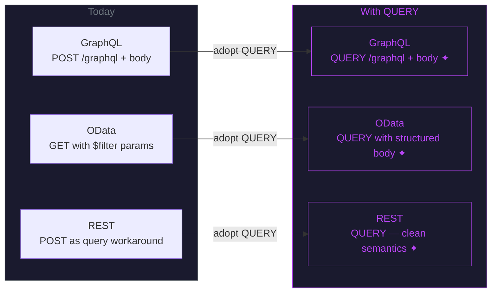
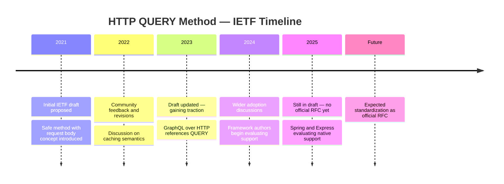

## The Problem with Existing HTTP Methods

REST APIs have a fundamental tension when it comes to complex queries. You need to fetch data (read-only), but your query is too complex to fit in a URL.

Consider searching for users with multiple filters:

```
# Works for simple cases
GET /api/v1/users?age=25&city=NewYork&status=active

# Breaks down for complex queries — URL too long, hard to read
GET /api/v1/users?filter[age][gte]=25&filter[age][lte]=40&filter[city][]=NewYork&filter[city][]=Boston&filter[tags][]=premium&sort[field]=name&sort[order]=asc&page=1&limit=20
```

Developers typically resort to two workarounds, both with trade-offs:

| Approach | Problem |
|---|---|
| `GET` with query params | URL length limits (~2000 chars), poor readability, no structured body |
| `POST` for querying | Semantically wrong — POST implies mutation, not safe, not cacheable |

The HTTP `QUERY` method was proposed to solve this cleanly.

## What is the QUERY Method?

The `QUERY` method is defined in the IETF draft [draft-ietf-httpbis-safe-method-w-body](https://datatracker.ietf.org/doc/draft-ietf-httpbis-safe-method-w-body/). It is a **safe, idempotent, cacheable** HTTP method that allows a **request body** to describe the query.



## QUERY vs GET vs POST



| Property | GET | POST | QUERY |
|---|---|---|---|
| Safe (no side effects) | ✅ | ❌ | ✅ |
| Idempotent | ✅ | ❌ | ✅ |
| Cacheable | ✅ | ❌ | ✅ |
| Request body | ❌ | ✅ | ✅ |
| Semantic meaning | Fetch resource | Create / action | Query with criteria |

## Request Format

A `QUERY` request looks like this:

```http
QUERY /api/v1/users HTTP/1.1
Host: api.example.com
Content-Type: application/json
Accept: application/json

{
  "filter": {
    "age": { "gte": 25, "lte": 40 },
    "city": ["New York", "Boston"],
    "status": "active",
    "tags": ["premium"]
  },
  "sort": {
    "field": "name",
    "order": "asc"
  },
  "page": 1,
  "limit": 20
}
```

The response is identical to what you'd expect from a `GET`:

```http
HTTP/1.1 200 OK
Content-Type: application/json

{
  "data": [...],
  "total": 142,
  "page": 1,
  "limit": 20
}
```

## Decision Flow — When to Use QUERY



## Implementing QUERY in Spring Boot

Spring Boot doesn't natively support `QUERY` yet since it's still a draft standard. Here's how to handle it today:

### Step 1 — Define the Request Body

```java
public record UserQueryRequest(
    UserFilter filter,
    SortCriteria sort,
    int page,
    int limit
) {}

public record UserFilter(
    Integer ageGte,
    Integer ageLte,
    List<String> city,
    String status,
    List<String> tags
) {}

public record SortCriteria(String field, String order) {}
```

### Step 2 — Handle QUERY in the Controller

```java
@RestController
@RequestMapping("/api/v1/users")
public class UserController {

    private final UserService userService;

    public UserController(UserService userService) {
        this.userService = userService;
    }

    @RequestMapping(method = RequestMethod.valueOf("QUERY"))
    public ResponseEntity<PagedResponse<User>> queryUsers(
            @RequestBody UserQueryRequest request) {
        return ResponseEntity.ok(userService.query(request));
    }
}
```

### Step 3 — Service Layer with JPA Specifications

```java
@Service
public class UserService {

    private final UserRepository userRepository;

    public UserService(UserRepository userRepository) {
        this.userRepository = userRepository;
    }

    public PagedResponse<User> query(UserQueryRequest request) {
        Specification<User> spec = buildSpec(request.filter());
        Pageable pageable = PageRequest.of(
            request.page() - 1,
            request.limit(),
            Sort.by(Sort.Direction.fromString(request.sort().order()), request.sort().field())
        );
        Page<User> result = userRepository.findAll(spec, pageable);
        return new PagedResponse<>(result.getContent(), result.getTotalElements());
    }

    private Specification<User> buildSpec(UserFilter filter) {
        return Specification
            .where(ageGte(filter.ageGte()))
            .and(ageLte(filter.ageLte()))
            .and(cityIn(filter.city()))
            .and(statusEq(filter.status()));
    }

    private Specification<User> ageGte(Integer age) {
        return age == null ? null :
            (root, query, cb) -> cb.greaterThanOrEqualTo(root.get("age"), age);
    }

    private Specification<User> ageLte(Integer age) {
        return age == null ? null :
            (root, query, cb) -> cb.lessThanOrEqualTo(root.get("age"), age);
    }

    private Specification<User> cityIn(List<String> cities) {
        return (cities == null || cities.isEmpty()) ? null :
            (root, query, cb) -> root.get("city").in(cities);
    }

    private Specification<User> statusEq(String status) {
        return status == null ? null :
            (root, query, cb) -> cb.equal(root.get("status"), status);
    }
}
```

## Caching QUERY Responses

One of the biggest advantages of `QUERY` over `POST` is cacheability.



Add cache headers in your controller:

```java
@RequestMapping(method = RequestMethod.valueOf("QUERY"))
public ResponseEntity<PagedResponse<User>> queryUsers(
        @RequestBody UserQueryRequest request) {
    PagedResponse<User> result = userService.query(request);
    return ResponseEntity.ok()
        .cacheControl(CacheControl.maxAge(60, TimeUnit.SECONDS))
        .body(result);
}
```

## Testing QUERY Endpoints

```java
@SpringBootTest
@AutoConfigureMockMvc
class UserControllerTest {

    @Autowired
    MockMvc mockMvc;

    @Autowired
    ObjectMapper objectMapper;

    @Test
    void shouldReturnFilteredUsers() throws Exception {
        UserQueryRequest request = new UserQueryRequest(
            new UserFilter(25, 40, List.of("New York"), "active", null),
            new SortCriteria("name", "asc"),
            1, 20
        );

        mockMvc.perform(request("/api/v1/users")
                .method("QUERY", objectMapper.writeValueAsBytes(request))
                .contentType(MediaType.APPLICATION_JSON)
                .accept(MediaType.APPLICATION_JSON))
            .andExpect(status().isOk())
            .andExpect(jsonPath("$.data").isArray())
            .andExpect(jsonPath("$.total").isNumber());
    }
}
```

## QUERY in GraphQL and OData Context



GraphQL over HTTP spec is already discussing adopting `QUERY` to replace `POST /graphql` for read-only operations.

## Current Status and Timeline



| Environment | Support |
|---|---|
| Browsers (fetch / XHR) | ✅ Custom methods work |
| Spring Boot | ✅ Via `RequestMethod.valueOf("QUERY")` |
| Express.js (Node) | ✅ Via custom routing |
| Nginx / reverse proxies | ⚠️ May need explicit allowlist |
| CDN caching (CloudFront, etc.) | ⚠️ Needs custom cache policy |
| OpenAPI / Swagger | ❌ Not yet supported natively |

## Key Takeaways

1. `QUERY` fills the gap between `GET` (no body) and `POST` (not safe/cacheable) for complex read operations
2. It is safe, idempotent, and cacheable — making it semantically correct for querying
3. Spring Boot supports it today via `RequestMethod.valueOf("QUERY")`
4. It's still an IETF draft — check proxy and CDN support before using in production
5. GraphQL and OData communities are already aligning with `QUERY` for future specs

> The best HTTP method is the one that accurately describes what you're doing. `QUERY` finally gives complex read operations the method they deserve.

The `QUERY` method won't replace `GET` or `POST` — it completes the picture. As the draft moves toward standardization, expect native framework support to follow quickly.
