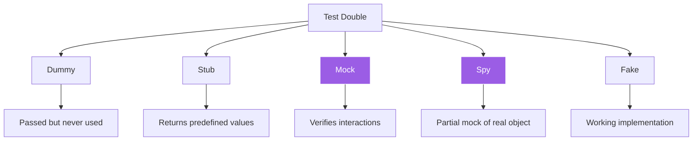
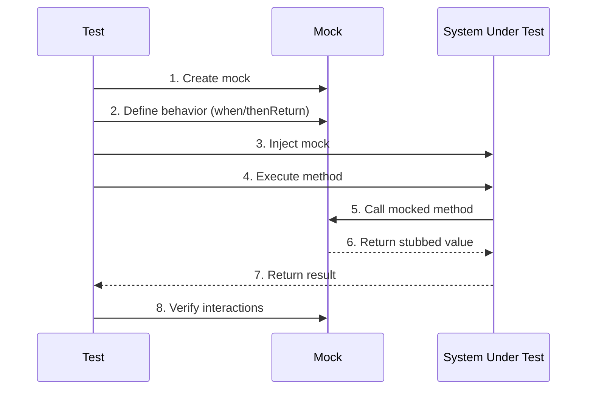
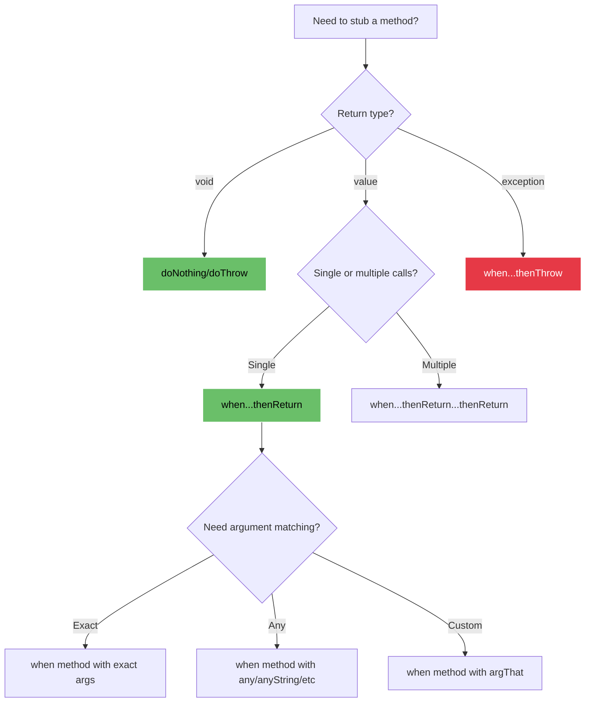
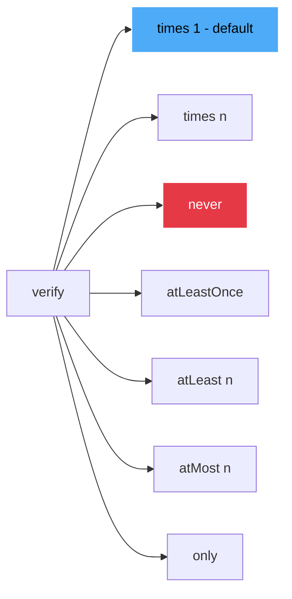
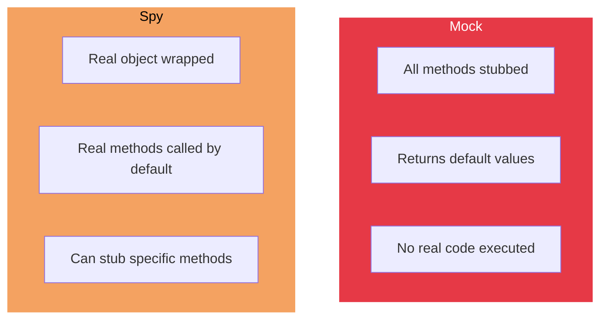
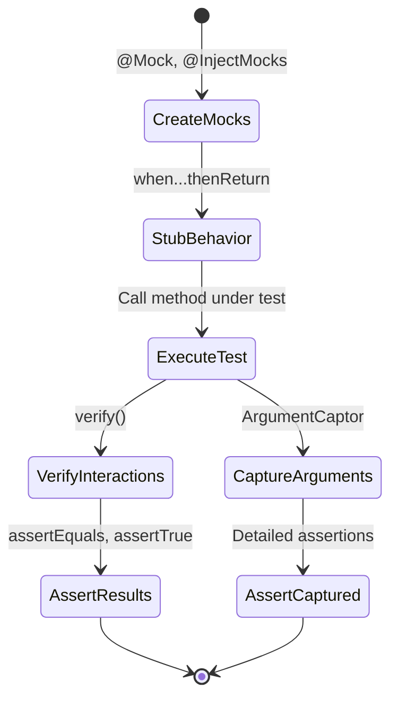
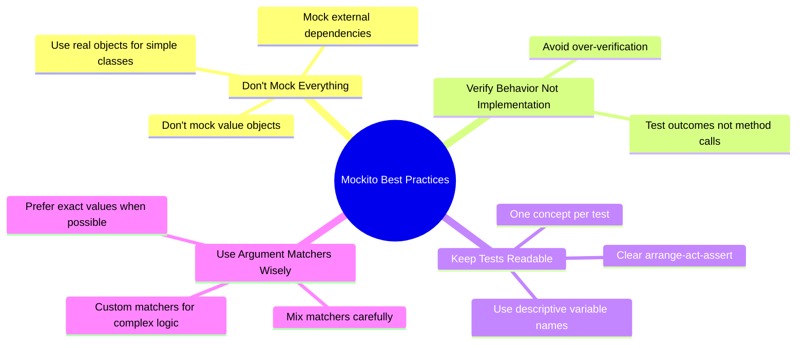

## Why Mockito?

Unit tests should test one thing at a time. When your class depends on a database, external API, or another service, you don't want those dependencies slowing down your tests or causing failures. Mockito lets you replace real dependencies with controlled test doubles.

At Amdocs, we use Mockito extensively to test billing logic without hitting actual payment gateways or databases. Here's everything you need to know.

## Test Doubles Hierarchy



## Setup

Add dependencies to your `pom.xml`:

```xml
<dependency>
    <groupId>org.mockito</groupId>
    <artifactId>mockito-core</artifactId>
    <version>5.11.0</version>
    <scope>test</scope>
</dependency>
<dependency>
    <groupId>org.mockito</groupId>
    <artifactId>mockito-junit-jupiter</artifactId>
    <version>5.11.0</version>
    <scope>test</scope>
</dependency>
```

## Basic Mocking Flow



## Creating Mocks

Three ways to create mocks:

| Method | Code | Use Case |
|--------|------|----------|
| **Annotation** | `@Mock` | Cleanest, requires `@ExtendWith(MockitoExtension.class)` |
| **Static method** | `Mockito.mock(Class)` | When you can't use annotations |
| **Spy** | `@Spy` or `Mockito.spy(Object)` | Partial mocking of real objects |

```java
@ExtendWith(MockitoExtension.class)
class PaymentServiceTest {

    @Mock
    PaymentGateway paymentGateway;

    @Mock
    NotificationService notificationService;

    @InjectMocks
    PaymentService paymentService;

    @Test
    void shouldProcessPaymentSuccessfully() {
        // Arrange
        when(paymentGateway.charge(100.0)).thenReturn(true);

        // Act
        boolean result = paymentService.processPayment(100.0);

        // Assert
        assertTrue(result);
        verify(paymentGateway).charge(100.0);
        verify(notificationService).sendConfirmation(anyString());
    }
}
```

## Stubbing Decision Tree



## Stubbing Methods

```java
// Return values
when(userRepository.findById(1L)).thenReturn(Optional.of(user));

// Return different values on consecutive calls
when(random.nextInt()).thenReturn(1, 2, 3);

// Throw exceptions
when(paymentGateway.charge(anyDouble())).thenThrow(new PaymentException("Declined"));

// Void methods
doNothing().when(emailService).send(anyString());
doThrow(new RuntimeException()).when(emailService).send("invalid@email");

// Return based on argument
when(calculator.add(anyInt(), anyInt())).thenAnswer(invocation -> {
    int a = invocation.getArgument(0);
    int b = invocation.getArgument(1);
    return a + b;
});
```

## Argument Matchers

| Matcher | Description | Example |
|---------|-------------|---------|
| `any()` | Any object (including null) | `any(User.class)` |
| `anyString()` | Any string | `anyString()` |
| `anyInt()` | Any int | `anyInt()` |
| `anyList()` | Any list | `anyList()` |
| `eq()` | Exact match | `eq("exact")` |
| `isNull()` | Null value | `isNull()` |
| `isNotNull()` | Non-null value | `isNotNull()` |
| `argThat()` | Custom matcher | `argThat(s -> s.length() > 5)` |

```java
// Mix matchers and exact values - use eq() for exact values
verify(service).process(eq("user123"), anyInt(), any(Order.class));

// Custom matcher
verify(emailService).send(argThat(email -> email.contains("@amdocs.com")));
```

## Verification Modes



```java
// Default: verify called exactly once
verify(paymentGateway).charge(100.0);

// Verify called exactly n times
verify(notificationService, times(3)).send(anyString());

// Verify never called
verify(auditService, never()).log(anyString());

// Verify at least once
verify(cache, atLeastOnce()).get("key");

// Verify at most n times
verify(retryService, atMost(3)).attempt();

// Verify this was the only interaction
verify(paymentGateway, only()).charge(100.0);

// Verify no more interactions
verifyNoMoreInteractions(paymentGateway);
```

## Argument Captors

Capture arguments passed to mocks for detailed assertions:

```java
@Test
void shouldSendEmailWithCorrectContent() {
    // Arrange
    ArgumentCaptor<Email> emailCaptor = ArgumentCaptor.forClass(Email.class);
    
    // Act
    orderService.placeOrder(order);
    
    // Assert
    verify(emailService).send(emailCaptor.capture());
    Email sentEmail = emailCaptor.getValue();
    
    assertEquals("order@example.com", sentEmail.getTo());
    assertTrue(sentEmail.getBody().contains("Order #123"));
    assertEquals("Order Confirmation", sentEmail.getSubject());
}
```

## Spies vs Mocks



```java
@Test
void demonstrateSpyBehavior() {
    List<String> realList = new ArrayList<>();
    List<String> spyList = spy(realList);
    
    // Real method is called
    spyList.add("one");
    assertEquals(1, spyList.size());
    
    // Stub specific method
    when(spyList.size()).thenReturn(100);
    assertEquals(100, spyList.size());
    
    // Other methods still work normally
    spyList.add("two");
    assertTrue(spyList.contains("two"));
}
```

## Testing Workflow



## Common Patterns

### Testing Void Methods

```java
@Test
void shouldHandleVoidMethodException() {
    doThrow(new RuntimeException("Connection failed"))
        .when(emailService).send(anyString());
    
    assertThrows(RuntimeException.class, () -> {
        notificationService.notifyUser("user@example.com");
    });
}
```

### Testing Callbacks

```java
@Test
void shouldInvokeCallback() {
    doAnswer(invocation -> {
        Callback callback = invocation.getArgument(1);
        callback.onSuccess("result");
        return null;
    }).when(asyncService).execute(anyString(), any(Callback.class));
    
    asyncService.execute("task", result -> {
        assertEquals("result", result);
    });
}
```

### Partial Mocking with Spy

```java
@Test
void shouldUseRealMethodsExceptStubbed() {
    UserService spy = spy(new UserService());
    
    // Use real implementation
    User user = spy.createUser("john@example.com");
    assertNotNull(user);
    
    // Stub specific method
    doReturn(true).when(spy).isAdmin(any());
    assertTrue(spy.isAdmin(user));
}
```

## Mock vs Real Object Comparison

| Aspect | Mock | Real Object |
|--------|------|-------------|
| **Speed** | ⚡ Instant | 🐌 Depends on implementation |
| **Dependencies** | ✅ None | ❌ Requires setup |
| **Predictability** | ✅ Fully controlled | ⚠️ May vary |
| **Test Scope** | ✅ Unit test | ❌ Integration test |
| **Maintenance** | ⚠️ Breaks if interface changes | ✅ Refactor-safe |

## Best Practices



### ✅ Do

```java
// Clear test structure
@Test
void shouldCalculateDiscountForPremiumUsers() {
    // Arrange
    when(userRepository.findById(1L)).thenReturn(Optional.of(premiumUser));
    
    // Act
    double discount = pricingService.calculateDiscount(1L);
    
    // Assert
    assertEquals(0.20, discount);
}
```

### ❌ Don't

```java
// Over-mocking and over-verification
@Test
void badTest() {
    when(mock1.method1()).thenReturn(value1);
    when(mock2.method2()).thenReturn(value2);
    when(mock3.method3()).thenReturn(value3);
    
    service.doSomething();
    
    verify(mock1).method1();
    verify(mock2).method2();
    verify(mock3).method3();
    verify(mock1, never()).otherMethod();
    // Testing implementation, not behavior
}
```

## Key Takeaways

1. **Mock external dependencies** — databases, APIs, file systems
2. **Don't mock value objects** — `String`, `LocalDate`, DTOs
3. **Verify behavior, not implementation** — test outcomes, not every method call
4. **Use `@InjectMocks` for constructor injection** — cleaner than manual setup
5. **Prefer `when...thenReturn` over `doReturn...when`** — more readable for non-void methods
6. **Use argument captors sparingly** — only when you need to inspect complex arguments

> The best tests are those that break when behavior changes, not when implementation changes.

Mockito is a tool, not a goal. Use it to isolate the code you're testing, but don't let mocking become more complex than the code itself.
